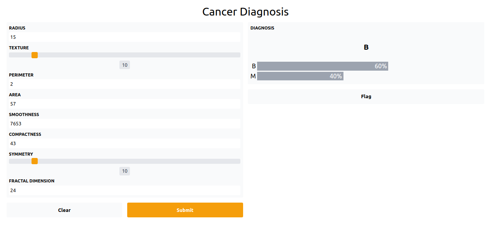

# Prostate-Cancer-Prediction
Predict Prostate Cancer Diagnosis using Machine Learning
Hello, I'm [Joseph Konka](https://www.linkedin.com/in/joseph-koami-konka/), Python enthousiast. This is the interface of the Cancer Diagnosis Prediction porject, I present during the webinar. Find the app [here](#)

## Setup environment
```sh
python3 -m venv env
source env/bin/activate
pip install -r requirements.txt
```

## Launch
```sh
python app.py
```
